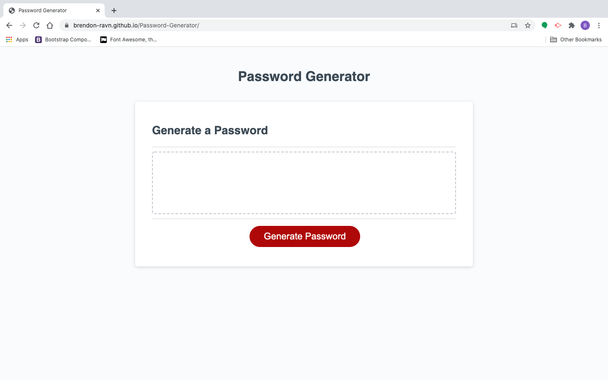
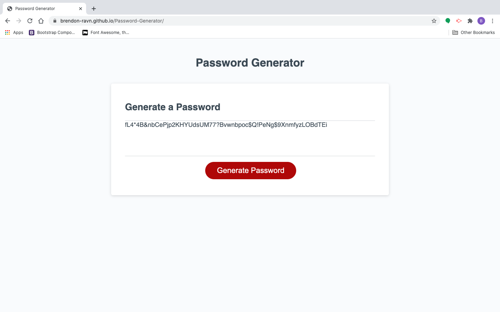

# Password-Generator

## Description
This was a homework assignment to use Javascript to create a Random Password Generator. 
I ended up having to go in and add to the css to get the password to stay in the box.

## Usage
You click the generate button then go through a few prompts and you get you a new password to use 
that you can copy and paste.

## Installation

repository https://github.com/Brendon-Ravn/Password-Generator
 
website https://brendon-ravn.github.io/Password-Generator/

